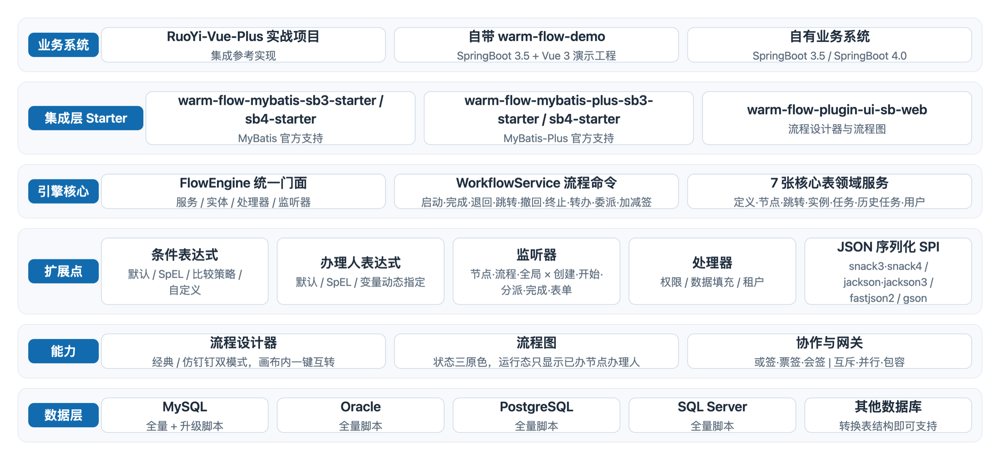
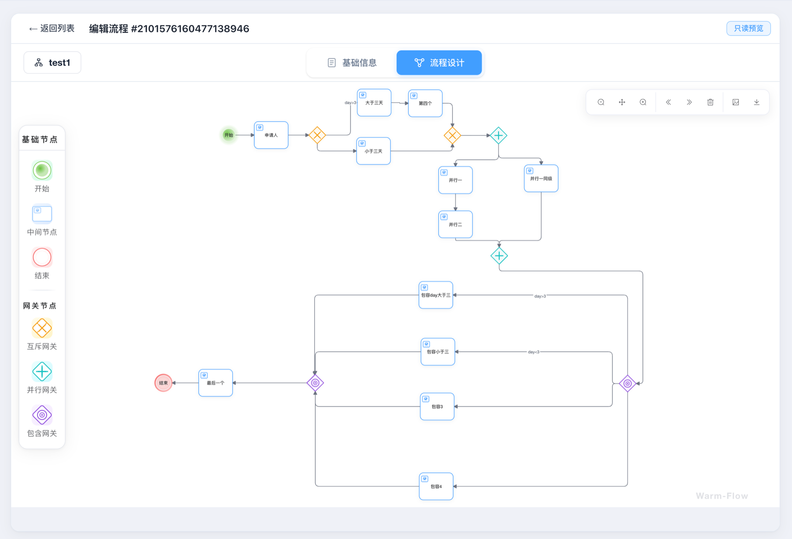
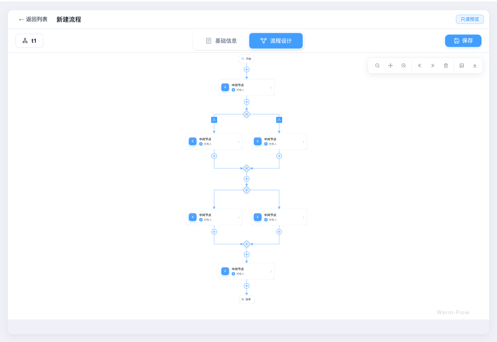

<h1 align="center" style="margin: 30px 0 30px; font-weight: bold;">Warm-Flow工作流</h1>
<p align="center">
    <a href="https://gitee.com/sgs98/warm-flow"></a>
    <a href="https://gitee.com/sgs98/warm-flow"></a>
    <a href="https://github.com/sgs98/warm-flow"></a>
    <a href="https://github.com/sgs98/warm-flow"></a>
    <a href="https://gitee.com/sgs98/warm-flow/blob/main/LICENSE"></a>
    <a href="https://central.sonatype.com/artifact/io.github.sgs98/warm-flow-core"></a>
    <a href="https://sgs98.github.io/warm-flow-doc/"></a>
</p>


**本项目是基于 [dromara/warm-flow](https://gitee.com/dromara/warm-flow) 二次开发维护的版本**

**项目代码、文档 均开源免费可商用 遵循开源协议即可**

**过去、现在和未来都不会有商业版！！！**

**开发完成请务必登记使用项目列表，[登记地址](https://gitee.com/sgs98/warm-flow/issues)**

## 介绍

> Dromara Warm-Flow，国产的工作流引擎，以其简洁轻量、五脏俱全、灵活扩展性强的特点，成为了众多开发者的首选。它不仅可以通过 **jar 包快速集成设计器**，同时原生支持**经典和仿钉钉双模式**，还具备以下显著优势：

- **简洁易用**：仅包含 7 张表，代码量少，上手和集成速度快。
- **设计器双模式**：通过 jar 包集成设计器，支持节点属性扩展，原生支持经典与仿钉钉两种模式，并支持画布内一键互转。
- **审批功能全面**：支持通过、退回、撤销、拿回、任意跳转、终止、转办、委派、加签减签、或签 / 会签 / 票签，以及互斥、并行和包容网关等多种审批操作。
- **流程图**：自带流程图渲染，支持节点状态三原色配置，运行态只展示已办节点的办理人。
- **条件表达式**：内置默认表达式和 SpEL 表达式，支持自定义扩展。
- **办理人表达式**：内置 `${handler}` 和 SpEL 表达式，支持传入流程变量动态指定办理人。
- **监听器**：节点、流程、全局三类作用范围，支持创建、开始、分派、完成及内置表单加载等监听时机，支持 SpEL 表达式与动态权限，可通过监听器扩展超时自动审批、远程请求、脚本执行等业务增强。
- **流程变量**：贯穿流程办理过程，可用于办理人表达式、条件表达式等动态计算。
- **扩展性强**：权限处理器、数据填充处理器、租户处理器、全局监听器、JSON 序列化实现均可自定义替换。
- **ORM 框架支持**：官方支持 MyBatis、MyBatis-Plus，均提供 SpringBoot3 / SpringBoot4 starter；Jpa、BeetlSql 等由社区扩展。
- **数据库支持**：支持 MySQL、Oracle、PostgreSQL 和 SQL Server，其他数据库只需要转换表结构即可支持。
- **多租户与逻辑删除**：引擎自身维护多租户和逻辑删除实现，也可复用对应 ORM 框架的实现方式；逻辑删除默认开启，可切换为物理删除。
- **兼容性**：支持 SpringBoot 3.5 / 4.0，JDK 17 起步，兼容 Java 17、Java 21。
- **实战项目**：提供基于 RuoYi-Vue-Plus 的实战项目，仓库内另自带 `warm-flow-demo` 演示工程（Spring Boot 3.5 + Vue 3），极具参考价值。

```
希望一键三连，你的⭐️ Star ⭐️是我持续开发的动力，项目也活得更长
```

>   **[github地址](https://github.com/sgs98/warm-flow.git)** | **[gitee地址](https://gitee.com/sgs98/warm-flow.git)**







## 快速开始

> 环境要求：JDK 17 及以上，Spring Boot 3.5 / 4.0（2.0 起已移除 Spring Boot 2 适配）

```xml
<!-- SpringBoot3 + MyBatis-Plus；使用 MyBatis 时换成 warm-flow-mybatis-sb3-starter，SpringBoot4 换成对应的 sb4 starter -->
<dependency>
    <groupId>io.github.sgs98</groupId>
    <artifactId>warm-flow-mybatis-plus-sb3-starter</artifactId>
    <version>2.0.0</version>
</dependency>

<!-- 需要流程设计器时引入，内置设计器静态资源 -->
<dependency>
    <groupId>io.github.sgs98</groupId>
    <artifactId>warm-flow-plugin-ui-sb-web</artifactId>
    <version>2.0.0</version>
</dependency>
```

- 建表脚本见下方「组件所需脚本」，完整的 yml 配置、设计器集成与二开说明见[使用文档](https://sgs98.github.io/warm-flow-doc/)
- 2.0 起 Maven 坐标由 `org.dromara.warm` 迁移为 `io.github.sgs98`，升级请先阅读[升级指南](https://sgs98.github.io/warm-flow-doc/master/other/upgrade_guide.html)

### 运行自带演示工程

仓库内 `warm-flow-demo` 提供 Spring Boot 3.5 + Vue 3 的全栈演示工程，可直接体验流程定义、审批与双模式设计器：

```bash
# 1) 准备数据库：引擎 7 张核心表 + demo 业务表 + 初始数据
mysql -uroot -p warm-flow < sql/mysql/warm-flow-all.sql
mysql -uroot -p warm-flow < warm-flow-demo/warm-flow-demo/src/main/resources/sql/schema.sql
mysql -uroot -p warm-flow < warm-flow-demo/warm-flow-demo/src/main/resources/sql/data.sql

# 2) 启动后端（默认 http://localhost:8080）
cd warm-flow-demo/warm-flow-demo && mvn spring-boot:run

# 3) 启动前端（默认 http://localhost:5173）
cd warm-flow-demo/warm-flow-demo-web && pnpm install && pnpm dev
```

- 数据库连接可用环境变量 `WARM_DEMO_DB_URL` / `WARM_DEMO_DB_USERNAME` / `WARM_DEMO_DB_PASSWORD` 覆盖，完整步骤见 [warm-flow-demo/README.md](./warm-flow-demo/README.md)

## 使用文档

- 使用文档：<https://sgs98.github.io/warm-flow-doc/>
- 更新日志：<https://sgs98.github.io/warm-flow-doc/master/other/update.html>
- 升级指南：<https://sgs98.github.io/warm-flow-doc/master/other/upgrade_guide.html>
- 问题反馈：<https://gitee.com/sgs98/warm-flow/issues>

## 组件所需脚本

- 首次导入：先创建数据库，再执行对应数据库的全量脚本，如 [sql/mysql/warm-flow-all.sql](./sql/mysql/warm-flow-all.sql)
- 版本升级：执行对应数据库的升级脚本，MySQL 升级脚本见 [sql/mysql/v1-upgrade](./sql/mysql/v1-upgrade)

## 与Activiti、Flowable对比

| **工作流**     | **Activiti**                  | **Flowable**                         | **Warm-Flow**                                     |
|-------------|-------------------------------|--------------------------------------|---------------------------------------------------|
| **项目背景**    | Apache 基金会。                   | 由 Activiti 原团队创建，功能更优化。              | 国产工作流引擎，[Dromara 社区](https://dromara.org/) 项目 [dromara/warm-flow](https://gitee.com/dromara/warm-flow) 的二次开发版 |
| **社区活跃度**   | 社区规模大，但近年活跃度下降。               | 社区活跃，迭代快                             | 文档和 RuoYi-Vue-Plus 实战案例**较完善，社区活跃，更新快**。            |
| **数据库表结构**  | 约 25 张表，分类简单。                 | 约 40 张表（部分版本达 79 张），分类更细。            | **仅 7 张表**，结构极简，维护成本低。                            |
| **功能与扩展性**  | 基础 BPMN 支持，插件机制有限。            | 支持动态流程修改、REST API、多实例任务优化。           | **审批功能全面**，基于json定义，支持办理人表达式、监听器、变量表达式、动态权限。   |
| **流程设计器**   | 需独立部署或集成第三方工具，通常只有经典模式设计器。    | 需额外配置或扩展，通常只有经典模式设计器。                | **通过 Jar 包快速集成**，支持节点属性扩展，原生支持**经典和仿钉钉双模式**。      |
| **流程图**     | 生成静态 BPMN 流程图，颜色和样式固定。        | 需结合 bpmn.js，集成难度高，扩展困难               | 自带流程图，通过 jar 包快速集成，支持节点状态颜色与功能扩展。                 |
| **数据驱动**    | 内部是通过mybatis进行增删改查，对其他orm不支持。 | 同左。                                  | 支持**多 ORM 框架**。                                   |
| **多租户与逻辑删除** | 需自行实现或依赖外部框架。                | 原生支持多租户和逻辑删除。                        | **原生支持多租户和逻辑删除**，也可复用 ORM 框架实现。                   |
| **数据库支持**   | 主流数据库（MySQL、Oracle 等）。        | 同左。                                  | 支持 MySQL、Oracle、PostgreSQL、SQL Server，**其他数据库（含国产库）转换表结构即可支持**。 |
| **条件表达式**   | 基础条件支持。                       | 支持 SpEL 表达式。                         | **内置 SpEL 和自定义表达式**，支持动态权限和参数传递。                  |
| **办理人表达式**  | 基于 UEL 实现，支持简单变量和固定角色分配。      | 支持 UEL、SpEL 表达式，可通过动态变量、角色、部门等灵活分配任务。 | **默认表达式和 SpEL，支持自定义规则**。                          |
| **适用场景**    | 简单流程或旧系统兼容。                   | 复杂流程、高扩展性需求。                         | **国产化、轻量级项目**，快速审批场景，灵活扩展和低代码集成。                  |


## 应用场景

Dromara Warm-Flow 作为一个国产的工作流引擎，其设计简洁轻量但功能全面，适用于多种应用场景，尤其是针对中小型项目。以下是一些典型的应用场景：

1. 企业内部流程管理：用于管理企业的日常业务流程，如请假、报销、采购审批等。
2. 项目管理：在项目管理中，Dromara Warm-Flow可以用来跟踪项目任务的状态，管理项目流程，确保项目按计划进行。
3. 客户服务流程：用于管理客户服务请求，如客户咨询、投诉处理、售后服务等。
4. 人力资源管理：在人力资源管理中，Warm-Flow可用于员工招聘、培训、绩效评估等流程的管理。
5. 财务和会计流程：管理财务审批流程，如发票审核、预算审批等。
6. IT服务管理：用于IT服务请求的处理，如IT支持请求、系统变更管理等。
7. 合规性和风险管理：帮助企业在遵守法规和标准的同时，管理风险和合规流程。


## 支持数据库类型
> 目前支持 MySQL、Oracle、PostgreSQL 和 SQL Server，其他数据库只需要转换表结构，使用 MyBatis 或 MyBatis-Plus 即可兼容

* [x] MySQL
* [x] Oracle
* [x] PostgreSQL
* [x] SQL Server
* [ ] ......


## 支持orm框架类型
* [x] mybatis
* [x] mybatis-plus
* [ ] jpa（社区扩展包，非官方维护）
* [ ] BeetlSql（社区扩展包，非官方维护）
* [ ] ......


## 项目结构

| 模块                  | 说明                                                                                   |
|---------------------|--------------------------------------------------------------------------------------|
| `warm-flow-core`    | 引擎核心，框架无关、ORM 无关、JSON 库无关                                                                  |
| `warm-flow-orm`     | ORM 适配层，包含 `warm-flow-mybatis`、`warm-flow-mybatis-plus`，每个 ORM 均提供 core 与 SpringBoot3 / SpringBoot4 starter |
| `warm-flow-plugin`  | 可插拔扩展，包含 `warm-flow-plugin-modes`（Spring 模式与 SpEL 表达式）、`warm-flow-plugin-json`（JSON 序列化）、`warm-flow-plugin-ui`（设计器与流程图后端） |
| `warm-flow-ui`      | 流程设计器前端工程（Vue3），独立构建，产物打包进 `warm-flow-plugin-vue3-ui`                             |
| `warm-flow-demo`    | 全栈演示工程（Spring Boot 3.5 + Vue 3），不参与 Maven 反应堆与正式发布                                   |
| `sql`               | MySQL、Oracle、PostgreSQL、SQL Server 的建表脚本，MySQL 另有 `v1-upgrade` 升级脚本                    |


## git提交规范

    init: 初始化  
    feat: 增加新功能  
    fix: 修复问题/BUG  
    perf: 优化/性能提升  
    refactor: 重构  
    revert: 撤销修改  
    style: 代码风格相关无影响运行结果的  
    update: 其他修改  
    upgrade: 升级版本  
